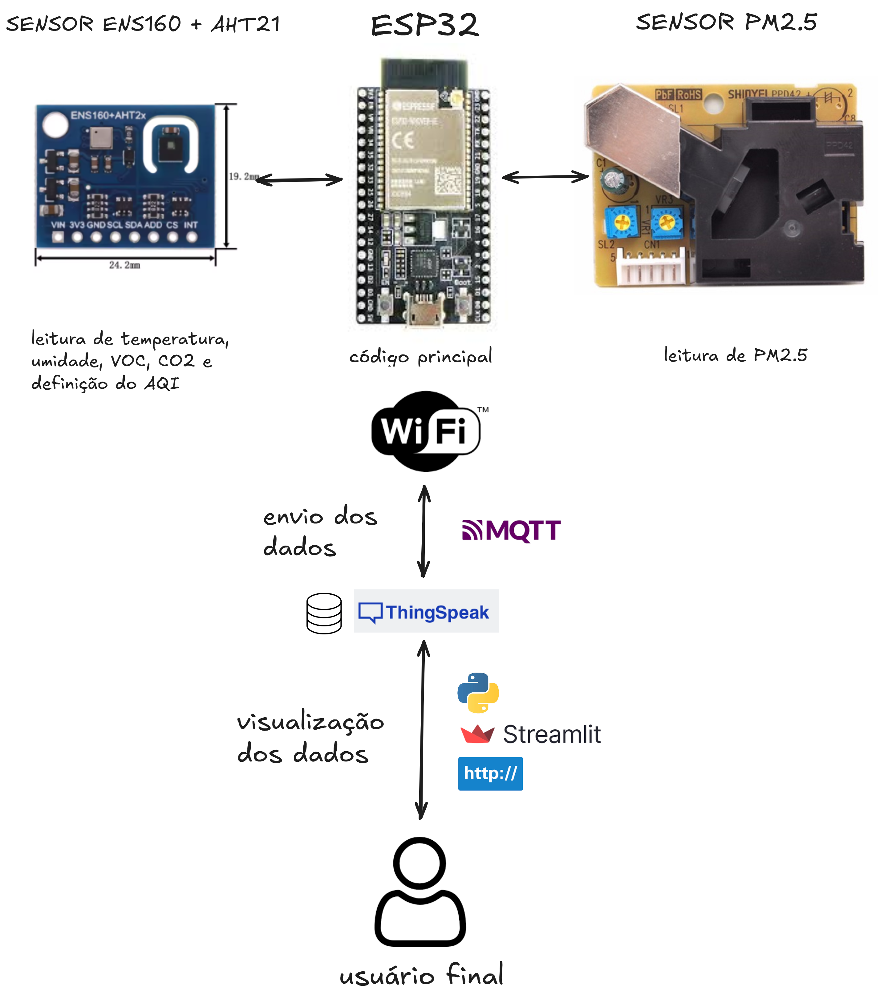

# 🏡 Monitoramento da Qualidade do Ar Interno - ESP32

[](https://www.python.org/downloads/)
[](https://streamlit.io/)

Este projeto, parte da discplina Projeto em Engenharia da Computação 2025/1 da UNIFESP-ICT/SJC oferece uma interface intuitiva e em tempo real para monitorar a **qualidade do ar interno** utilizando dados coletados por um dispositivo ESP32. Ele coleta dados de temperatura, umidade, CO₂ equivalente (eCO₂), compostos orgânicos voláteis (TVOC), material particulado (PM2.5) e índice de qualidade do ar (AQI), e os envia para a plataforma de IoT ThingSpeak via protocolo MQTT. A aplicação web, desenvolvida com Streamlit, exibe leituras dos sensores, fornece referências teóricas sobre os parâmetros monitorados e permite receber alertas via e-mail.

---

## ✨ Funcionalidades

* **Leitura de Sensores em Tempo Real**: Visualize a última leitura e a média da última hora para parâmetros como **Temperatura**, **Umidade**, **VOC** (Compostos Orgânicos Voláteis), **eCO₂** (Dióxido de Carbono Equivalente), **PM2.5** (Material Particulado 2.5) e **AQI** (Índice de Qualidade do Ar).
* **Série Histórica**: Acompanhe a evolução dos dados de cada sensor ao longo do tempo através de gráficos interativos.
* **Referência Teórica**: Acesse informações detalhadas sobre os sensores utilizados (AQI, CO2, PM2.5, Temperatura e Umidade) e tabelas de classificação para os níveis de AQI e eCO₂/CO₂ a partir do datasheet.
* **Alertas Personalizados**: Cadastre seu e-mail para receber notificações quando os níveis dos sensores ultrapassarem os limites recomendados.
* **Suporte**: Obtenha informações de contato para suporte e acesso direto ao repositório do projeto.

---

## 🚀 Como Executar

Acesse o projeto através do link [] ou siga os passos abaixo para colocar o projeto em funcionamento na sua máquina local:

### Pré-requisitos

Certifique-se de ter o **Python 3.9** ou superior instalado. Você pode baixá-lo em [python.org](https://www.python.org/downloads/).

### 1. Clonar o Repositório

Primeiro, clone este repositório para o seu ambiente local:

```bash
git clone https://github.com/gbeloso/esp32-environment.git
cd esp32-environment
```

### 2. Configurar Variáveis de Ambiente
Crie um arquivo .env na raiz do projeto e adicione a chave da sua API de leitura de dados do Thingspeak.

```bash
API_URL="SUA__API_AQUI"
```

Substitua "SUA_API_AQUI" pela API KEY real.

### 3. Instalar dependências

Instale as bibliotecas Python necessárias usando pip a partir do arquivo requirements.txt
```bash
pip install -r requirements.txt
```

### 4. Executar a Aplicação Streamlit
Após instalar as dependências, execute a aplicação Streamlit a partir do diretório raiz do projeto:

```bash
streamlit run app.py
```

### Sobre o código do arduíno

## 📜 Descrição Geral

O firmware é projetado para ser robusto e flexível. Ele se conecta a uma rede Wi-Fi, inicializa múltiplos sensores, realiza leituras periódicas e as publica em um canal ThingSpeak. O sistema inclui uma rotina de aquecimento para os sensores de gás, garantindo maior precisão nos dados, e permite configuração dinâmica da rede Wi-Fi através do Monitor Serial.

## ✨ Funcionalidades

-   **Leitura Multi-Sensor**: Coleta dados dos sensores:
    -   **AHTx0**: Temperatura (°C) e Umidade Relativa (%).
    -   **ENS160**: eCO₂ (ppm), TVOC (ppb) e AQI (Índice de 1 a 5).
    -   **Sensor de Poeira (PPD42NS ou similar)**: Concentração de PM2.5 (pcs/0.01cf).
-   **Conectividade IoT**: Envia os dados para a plataforma **ThingSpeak** usando o protocolo **MQTT**.
-   **Configuração de Rede Flexível**:
    -   Permite inserir o SSID e a senha do Wi-Fi via Monitor Serial na inicialização.
    -   Possui credenciais de rede padrão como fallback.
-   **Rotina de Aquecimento**: Inclui um período de aquecimento de 3 minutos para o sensor ENS160, garantindo a estabilização e a precisão das leituras de qualidade do ar.
-   **Envio Periódico e Controlado**: Publica os dados em intervalos configuráveis (definido para **6 minutos**).
-   **Controle Manual**: Permite forçar o envio de dados ou pausar/retomar o envio automático através de comandos no Monitor Serial.

## 🛠️ Componentes Necessários

### Hardware
-   Microcontrolador **ESP32**.
-   Sensor de Temperatura e Umidade **Adafruit AHT10 ou AHT20**.
-   Sensor de Qualidade do Ar **ScioSense ENS160**.
-   Sensor de Partículas **PM2.5** (ex: PPD42NS, que funciona com base em `pulseIn`).
-   Protoboard, jumpers e fonte de alimentação.

### Software e Bibliotecas
-   Arduino IDE com o suporte para placas ESP32 instalado.
-   As seguintes bibliotecas (instaláveis através do Gerenciador de Bibliotecas da Arduino IDE):
    -   `WiFi`
    -   `Wire`
    -   `PubSubClient` by Nick O'Leary
    -   `Adafruit AHTX0` by Adafruit
    -   `ScioSense ENS160` by ScioSense

## 🚀 Configuração e Uso

1.  **Montagem do Hardware**:
    -   Conecte os sensores ENS160 e AHTx0 ao barramento I2C do ESP32. No código, os pinos estão definidos como:
        -   `SDA`: Pino `GPIO 16`
        -   `SCL`: Pino `GPIO 17`
    -   Conecte o pino de saída do sensor de PM2.5 ao `GPIO 12`.
    -   Alimente todos os componentes com a tensão correta (3.3V ou 5V, conforme a especificação de cada um).

2.  **Configuração do Software**:
    -   Abra o arquivo `.ino` na Arduino IDE.
    -   **Importante**: Atualize as credenciais do seu canal **ThingSpeak MQTT** no código:
      ```cpp
      const char *client_id = "SEU_CLIENT_ID";
      const char *mqtt_username = "SEU_MQTT_USERNAME";
      const char *mqtt_password = "SUA_MQTT_API_KEY";
      const char *topic = "channels/SEU_CHANNEL_ID/publish";
      ```
    -   Se desejar, altere as credenciais de Wi-Fi padrão:
      ```cpp
      const char* default_ssid = "NOME_DA_SUA_REDE";
      const char* default_password = "SENHA_DA_SUA_REDE";
      ```

3.  **Carregar e Executar**:
    -   Selecione a sua placa ESP32 e a porta COM correta na Arduino IDE.
    -   Faça o upload do código.
    -   Abra o **Monitor Serial** com a velocidade de **115200 baud**.

4.  **Primeira Execução**:
    -   Ao iniciar, o dispositivo aguardará 10 segundos. Você pode digitar o nome e a senha de uma rede Wi-Fi diretamente no Monitor Serial.
    -   Caso nada seja digitado, ele usará as credenciais padrão definidas no código.
    -   O sistema iniciará a rotina de aquecimento de 3 minutos, mostrando um progresso com pontos (`.`).
    -   Após o aquecimento, ele fará a primeira leitura e publicação de dados e continuará publicando a cada 6 minutos.

## 📡 Formato dos Dados (Payload MQTT)

Os dados são enviados ao ThingSpeak em uma única string, com cada valor atribuído a um campo (`field`). Certifique-se de que seu canal ThingSpeak tenha pelo menos 6 campos ativos.

-   `field1`: **Temperatura** (em °C)
-   `field2`: **Umidade** (em %)
-   `field3`: **TVOC** (em ppb)
-   `field4`: **eCO₂** (em ppm)
-   `field5`: **PM2.5** (em pcs/0.01cf)
-   `field6`: **AQI** (Índice de Qualidade do Ar)

**Exemplo de Payload:** `field1=25.50&field2=60.10&field3=50&field4=450&field5=15.25&field6=1`

## ⌨️ Comandos via Serial

Você pode interagir com o dispositivo em tempo real através do Monitor Serial:

-   Digite `1` e pressione Enter: Força uma leitura e publicação imediata dos dados.
-   Digite **qualquer outro caractere** e pressione Enter: Alterna (ativa/desativa) o modo de envio automático de dados.

### 🛠 Principais Tecnologias Utilizadas


- ESP32: microcontrolador com o código principal
- Sensor ENS160 + AHT21: temperatura, umidade, VOC, CO2 e AQI
- Sensor PM2.5 (PPD42NS): partículas PM2.5
- MQTT: protocolo de envio dos dados
- Thingspeak: para receber e armazenar os dados
- Streamlit: Framework Python para criação de aplicações web interativas.
- Requests: Biblioteca Python para fazer requisições HTTP a APIs.
- Pandas: Biblioteca para manipulação e análise de dados.
- re: Módulo para operações com expressões regulares.
- datetime: Módulo para manipulação de datas e horas.
- streamlit-autorefresh: Componente Streamlit para recarregar a página automaticamente.
- python-dotenv: Para carregar variáveis de ambiente de um arquivo .env.